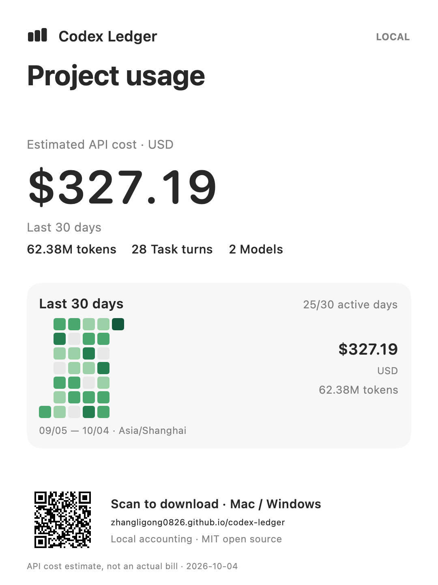

# Codex Ledger

A local Codex work ledger for **macOS and Windows**. See what each goal, project, conversation and task turn used in tokens and estimated API cost, with a 30-day contribution-style heatmap.

[Download and install](https://zhangligong0826.github.io/codex-ledger/) · [中文](README.zh-CN.md) · [Validation](QA.md) · [Pricing](PRICING.md)

## Install the free beta

**1.2.0-beta.3** — macOS 14+ (Apple Silicon/Intel), Windows 11 (x64/ARM64).

Mac: download the universal DMG from the [release](https://github.com/zhangligong0826/codex-ledger/releases/tag/v1.2.0-beta.3), open it and drag Codex Ledger to Applications. Click the menu-bar icon after launching. Homebrew:

```sh
brew install --cask zhangligong0826/tap/codex-ledger
```

Windows: use the installer matching your architecture, or extract the portable ZIP and run `CodexLedger.exe`. The system-tray icon opens the overview and work ledger. The .NET runtime is bundled, and installation is per-user. Upgrades and uninstall preserve local settings/goal books.

This free beta has ad-hoc signing on macOS and no formal Windows publisher signature or Apple notarization. Use the [Apple first-launch instructions](https://support.apple.com/guide/mac-help/open-a-mac-app-from-an-unknown-developer-mh40616/mac) and your Windows device's installation policy. Corporate devices may require administrator approval. No installer disables Gatekeeper, quarantine, Defender or SmartScreen.

SHA-256 values for all six binary assets are in `CHECKSUMS.txt` on the release. Windows ARM64 is cross-built; native ARM64 execution and physical Windows device acceptance are not verified. See [QA.md](QA.md).

## Your goals, measured

Create a goal such as “Build my app” or “Finish this paper,” then select projects, conversations or individual turns and review the transfer preview. Attribution priority is **turn → conversation → project**; each turn belongs to at most one goal. Explicit unassignment stops inheritance. New selections default to a fixed set of historical turns. Dated or whole-project/chat rules can optionally include future starts; legacy assignments retain their original ongoing behavior. Attribution changes can be undone.

Goal lifetime totals are independent of the date filter. Confirming completion appends an immutable snapshot of membership, tokens, Decimal cost, pricing coverage and catalog identity. New ongoing rules stop receiving newly started work. Later responses are shown separately; reopening retains completion history and does not resume stopped rules. Deleting a goal removes rules, never source logs.

Projects group by repository/work directory, combine Git worktrees, and distinguish identically named folders by path. Conversations crossing projects retain their scoped amounts. Drill down from goals/projects into chats and turns; search and export the current scope. English/Chinese UI and system/light/dark themes are available.

Goals can have an optional USD budget. Budget remaining/overrun uses the frozen amount for completed goals, and the lifetime estimate for active goals; unknown pricing and incomplete records are called out. Switch the 30-day heatmap between token and estimated-cost intensity in Settings.

Settings includes local goal-book backup/export/import. Imports are validated before replacing data; automatic recovery copies retain the most recent 20 valid snapshots per source. Backups contain private names and attribution rules—keep them private. Project paths may need reassignment when moving between machines.

## Share an image

The Share menu provides **Create share card**, **Save current view**, and **Export CSV**. Cards are 1080 × 1440 PNGs showing estimated USD, tokens, task turns, the last 30 days and an installation QR. Completed goals emphasize their frozen completion amount; selected-date usage and the last 30 days are labeled separately. Sharing during refresh uses the last published snapshot.

Names, paths and chat titles are hidden on cards by default. You may enter a public title or opt into the original name. Current-view captures retain visible content. Preview before copying/saving. Generation freezes the statistics, and all image processing stays on your device. Cards and CSV include the actual captured date range, timezone and source completeness; completion prices retain their original verification date. Scan the QR to reach the same download page after future updates.

## Accounting and privacy

Total tokens = input + output. Cached input and reasoning output are subsets, not additional tokens. Response IDs are deduplicated across active/archived copies, inherited fork history is excluded, and matched child calls are attributed to the parent turn. Legacy cumulative counters use increments/reset segments. Mixed legacy/response-ID logs are reconciled per counter interval; ambiguous overlap and malformed completed records remain visible as scoped incomplete coverage. Relevant or unscoped issues prevent freezing a completion amount; unknown pricing alone preserves unpriced usage and permits completion. Local calendar days and DST boundaries apply per response.

Cost uses the bundled offline Standard API price snapshot, per deduplicated response, including cache and long-context rules. Unknown models remain unpriced; partial estimates carry `*`. **An API estimate is not a subscription payment or actual bill.** Rates, exclusions and the verification date are documented in [PRICING.md](PRICING.md).

The app makes no network/model calls, reads no login credentials, and uploads no chats. SQLite titles are optional and read-only; missing/incompatible metadata falls back to logs. Repository discovery reads bounded Git pointer files without invoking Git, hooks or configuration. Exported CSV/current-view captures may include personal titles and paths.

Default source: `CODEX_HOME` or your user folder's `.codex`, including `sessions` and `archived_sessions`; choose another source in Settings. Changed logs are checked every 30 seconds in the background. First lifetime scans can take longer. Each source has its own local goal book. macOS stores independent atomic v2 books under `~/Library/Application Support/CodexLedger/GoalBooks`; existing v1 UserDefaults entries are preserved with raw recovery copies. Windows stores independent v2 books and settings under `%LOCALAPPDATA%\CodexLedger`. Portable exports are v2; v1 imports are migrated without inventing missing completion membership.

## Build and contribute

MIT licensed. macOS requires Apple Command Line Tools for compatible icons, or initialized Xcode 26+ for native layered icons. End users need neither. Windows uses .NET 10, Microsoft.Data.Sqlite.Core/SQLitePCLRaw and QRCoder; build tools and libraries are documented in [THIRD-PARTY.md](THIRD-PARTY.md).

```sh
git clone https://github.com/zhangligong0826/codex-ledger.git
cd codex-ledger
zsh test.sh
zsh build.sh
zsh package.sh
```

Windows build/test/package, from PowerShell:

```powershell
dotnet run --project Windows/Ledger.Tests
dotnet build Windows/Ledger.App
dotnet run --project Windows/Ledger.App -- --show-dashboard
./Windows/package.ps1
```

Inno Setup is required only for Windows installer packaging. Self-contained output is in `dist/`. The common offline catalog and synthetic fixtures in `Common/` are used by both implementations. Native icon workflow: [ICON_DESIGN.md](ICON_DESIGN.md). Contribution/release instructions: [CONTRIBUTING.md](CONTRIBUTING.md), [RELEASING.md](RELEASING.md).

Independent community project; not affiliated with OpenAI, Apple or Microsoft.

## Share preview

The card below uses synthetic demo data. Your cards are generated locally; names and paths are hidden until you choose to show them. The QR always points to the fixed download page.


