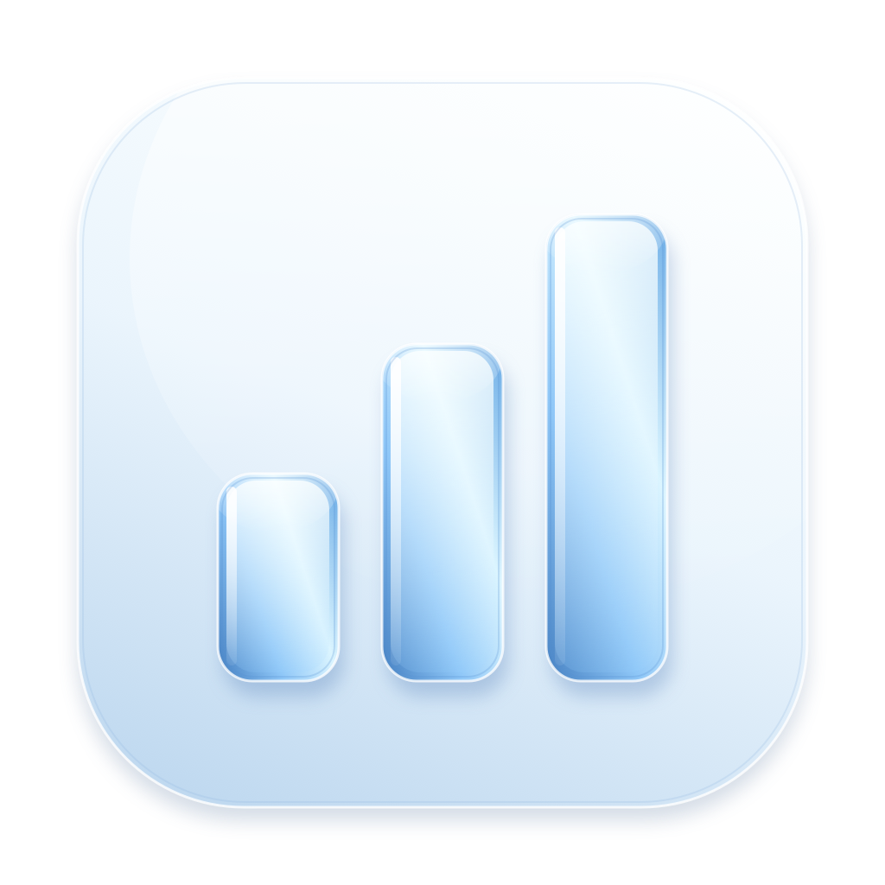

# Codex Ledger



A native macOS menu bar app that shows what your local Codex tokens worked on: coding, questions, research, presentations, documents, spreadsheets, and design.

[简体中文](README.zh-CN.md) · [Download](https://github.com/zhangligong0826/codex-ledger/releases/latest) · [Homebrew tap](https://github.com/zhangligong0826/homebrew-tap)

## Install

Requires **macOS 14 or later**. One universal binary supports Apple Silicon and Intel.

```sh
brew install --cask zhangligong0826/tap/codex-ledger
```

Open **Codex Ledger** from Applications. Click its menu bar icon for a compact overview; choose **View projects & conversations** for the ledger. The app stays running when you close the ledger window.

Alternatively, download the DMG from [Releases](https://github.com/zhangligong0826/codex-ledger/releases/latest), open it, and drag Codex Ledger into Applications. A ZIP and SHA-256 checksums are also provided.

**First launch:** releases currently use an ad-hoc signature and are **not Apple notarized**. macOS may block opening. After attempting to open, use **System Settings → Privacy & Security → Open Anyway** if you trust this release, then confirm Open. Follow [Apple's instructions](https://support.apple.com/102445). The installer preserves Gatekeeper and quarantine protections. A checksum verifies file integrity; it does not establish publisher identity.

```sh
brew upgrade --cask zhangligong0826/tap/codex-ledger
brew uninstall --cask zhangligong0826/tap/codex-ledger
```

Uninstalling does not remove your Codex logs. Keep one installed copy; when moving from manual installation to Homebrew, quit and remove the old app bundle first. Do not delete your `.codex` folder.

## What you can see

- Today, Yesterday, Last 7 days, Last 30 days, and All time.
- **Projects → Conversations → Task turns**, including input, cached input, output, reasoning output, models, work categories, and recent activity.
- Repositories combine subdirectories and linked worktrees. Ordinary folders remain separate by full path. Unidentified projects retain usage.
- Conversations spanning projects are split by each turn's working directory. Project views show that project's share; global conversations show full usage within the selected date range.
- **Estimated API cost in USD**, including input/cache/output breakdowns, project/conversation/turn/model costs and explicit unpriced coverage.
- Search project names, paths, conversation titles, requests, and models. Export project/conversation summaries, task turns, or model usage as CSV.
- English by default, Simplified Chinese, and System/Light/Dark. Optional launch at login and menu bar token count.
- Local rule-based classification with manual corrections. Open the original Codex chat or linked local files.

The overview is at most **340 × 460 points**, with a fixed header/footer and scrollable body. Right-click the menu bar icon for actions. ⌘L toggles the overview while active; Escape dismisses it; ⌘Q quits. The overview supports ⌘R to refresh.

## Accounting and privacy

**Total tokens = input + output.** Cache and reasoning are subsets, not additional tokens. Dates follow response timestamps in the Mac's local timezone. Task turns differ from model calls.

Modern logs use response IDs for deduplication and exclude inherited conversation copies. Legacy logs use cumulative deltas and handle resets. Child-agent responses matching a parent turn belong to its task and project. Unmatched internal activity remains visible. Project, conversation, task, and model totals come from the same deduplicated calls.

Only readable local `sessions` and `archived_sessions` logs are covered. Other devices, cloud-only work, deleted logs, and unrecorded usage may be absent. These numbers are **not subscription quota percentages or a billing statement**. Classification is a heuristic; it can be corrected. Linked files are existing paths found in logs, not proof that an artifact was completed.

Costs use bundled [official OpenAI Standard API prices](https://developers.openai.com/api/docs/pricing), verified **2026-10-04**, applied to deduplicated responses. Cached input is charged at its own rate; reasoning is already included in output. Long-context pricing is evaluated per response, never on project totals. Unverified legacy context uses short-context rates. Unknown model names are not guessed: partial estimates carry `*`, and fully unpriced usage shows **Unpriced** rather than $0. Historical usage also uses the current bundled snapshot, including promotional prices. Cache-write premiums, Fast/Batch/Flex differences, tool fees and taxes are excluded. A subscription does not charge this amount per token. CSV preserves decimal precision and includes priced/unpriced coverage and the price date. See [pricing details](PRICING.md).

The app makes **no network requests**, uses no API key, calls no model, reads no login credentials, and uploads no chats. Local conversation titles are read from compatible SQLite metadata in read-only mode; missing or incompatible metadata falls back to log requests. Git discovery uses read-only `rev-parse` commands. The scan index stays in memory; preferences and classification overrides use local UserDefaults. CSV is written only on export and may contain private titles and paths.

The default source is `CODEX_HOME` or `~/.codex`; change it in Settings. Every 30 seconds, only changed files are reparsed. Longer ranges expand scanning on demand. Repository lookup and aggregation use a serial background queue. All time covers all readable logs still retained on this Mac.

## Build and contribute

Needs Apple's Command Line Tools (`xcode-select --install`), no third-party packages.

```sh
git clone https://github.com/zhangligong0826/codex-ledger.git
cd codex-ledger
zsh test.sh
zsh build.sh
zsh package.sh
```

The app, universal ZIP, DMG and `CHECKSUMS.txt` are written to `dist/`. Set `CODEX_LEDGER_ARCH=arm64` or `x86_64` for one architecture; packaging requires universal. Set `CODEX_LEDGER_OUTPUT_DIR` for another output directory. Optional `CODEX_LEDGER_INSTALL=1 zsh build.sh` installs into `~/Applications`; quit the previous copy first.

```sh
# Synthetic data; isolated preferences; no personal logs read
"dist/Codex Ledger.app/Contents/MacOS/CodexLedger" --demo
# Read-only aggregate JSON, without opening a window
"dist/Codex Ledger.app/Contents/MacOS/CodexLedger" --diagnose --scope=30d
```

Diagnostic scopes: `today`, `yesterday`, `7d`, `30d`, `all`; `CODEX_LEDGER_SOURCE` overrides its source directory. Demo states `ready`, `loading`, `empty`, `error` use `CODEX_LEDGER_DEMO_STATE`. Rebuild the original icon with `zsh make-icon.sh`; its editable SVG reference is in `Assets/`.

See [contributing](CONTRIBUTING.md), [validation](QA.md), and [releasing](RELEASING.md). CI covers native Apple Silicon and Intel builds and a macOS 14 runner. Visual inspection is separate from headless CI.

## License and credits

[MIT](LICENSE), including original source and icon. Independent community project, unaffiliated with OpenAI or Apple. The compact overview takes layout inspiration from [OpenUsage](https://www.openusage.ai/); it uses an independent name, icon, and SwiftUI implementation.
